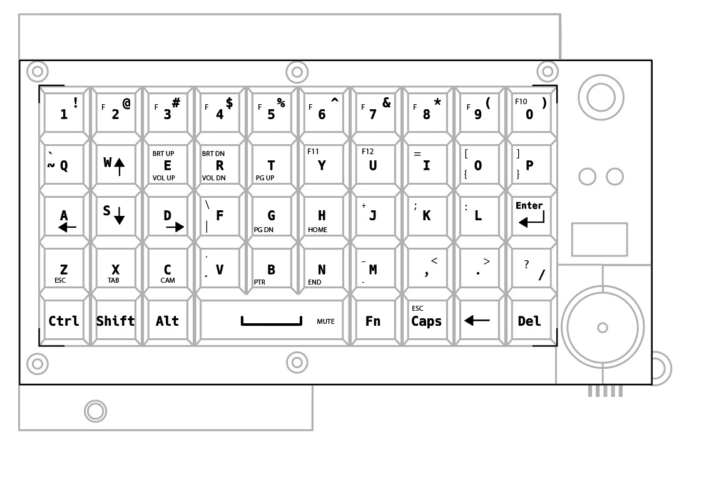

# Cyberdeck Keyboard Firmware

This repository contains the custom firmware for the Cyberdeck Keyboard built on a Raspberry Pi Pico (RP2040) using the [KMK Firmware](https://github.com/KMKfw/kmk_firmware) library.

---

## Keyboard Layout

Below is the layout configuration diagram of the keyboard keys:



---

## Repository Files & Purpose

Here is an explanation of the files in this repository and what they are used for:

### 1. `code.py` (Main Firmware)
- **Purpose**: This is the main program file that runs continuously on your keyboard when it is powered on.
- **Key Features**:
  - Sets up the 5x10 key matrix pins.
  - Implements the dual-layer keymap (Base Layer and Fn Layer).
  - Handles the custom **Analog Joystick** code: reads X/Y potentiometers to control mouse cursor movement, manages mouse clicks (left click/right click), and handles web page scrolling when the `Fn` layer is active.
  - Handles the custom dual-action **Volume & Screen Brightness** keys.
  - Houses the macro shortcuts for **Microphone Mute** (`Ctrl+Shift+M`) and **Webcam Toggle** (`Alt+V`).

### 2. `boot.py` (Boot Setup & Lockout)
- **Purpose**: Runs once during the initial startup (boot phase) of the Pico, before the main `code.py` loads.
- **Key Features**:
  - Configures the USB interfaces, enabling standard Keyboard, Mouse, and Consumer Control (media keys) HID devices.
  - **USB Write Protection Lockout**: Automatically hides/disables the `CIRCUITPY` USB drive to prevent anyone from reading or editing your code when they plug it in.
  - **Developer Bypass Switch**: Checks if the joystick click button (GP28) is held down during startup. If pressed, it keeps the USB drive visible so you can edit the files.

### 3. `test_matrix.py` (Matrix Diagnostic Tool)
- **Purpose**: A diagnostic script used to test the physical wiring of the key matrix.
- **Key Features**:
  - Sequentially scans the column and row pins.
  - Prints a report to the serial console showing which row/column junctions are electrically connected.
  - Used to find broken switches, backwards diodes, or short circuits before loading the full KMK firmware.

### 4. `KeyboardLayout.jpeg` (Layout Diagram)
- **Purpose**: Reference image showing the physical keys and secondary layer labels.

---

## Keyboard Layout & Mappings

### Base Layer (Normal Typing)
Standard 50-key matrix layout mapping. Normal keys function as expected.

### Fn Layer (Hold Fn to access)
To access the secondary layout, **hold down the `Fn` key** (7th key in the bottom row, next to Caps) and press the target key:

| Target Function | Combination | What it does |
| :--- | :--- | :--- |
| **Volume Up** | Hold `Fn` + press `E` | Increases system volume |
| **Volume Down** | Hold `Fn` + press `R` | Decreases system volume |
| **Brightness Up** | Hold `Fn` + Hold `Shift` + press `E` | Increases screen brightness |
| **Brightness Down** | Hold `Fn` + Hold `Shift` + press `R` | Decreases screen brightness |
| **Microphone Mute/Unmute** | Hold `Fn` + press `Spacebar` | Mutes/unmutes mic in Zoom, Teams, Discord (sends `Ctrl + Shift + M`) |
| **Camera Toggle** | Hold `Fn` + press `C` | Toggles webcam in Zoom (sends `Alt + V`) |
| **Backslash (`\`)** | Hold `Fn` + press `F` | Types `\` |
| **Plus (`+`)** | Hold `Fn` + press `J` | Types `+` |
| **Semicolon (`;`)** | Hold `Fn` + press `K` | Types `;` |
| **Colon (`:`)** | Hold `Fn` + press `L` | Types `:` |
| **Equal (`=`)** | Hold `Fn` + press `I` | Types `=` |
| **Tab** | Hold `Fn` + press `X` | Sends `Tab` |
| **Escape** | Hold `Fn` + press `Caps` | Sends `Esc` |
| **Print Screen** | Hold `Fn` + press `B` | Takes a screenshot (sends Print Screen) |

---

## Analog Joystick Controls

The custom analog joystick acts as a fully integrated mouse interface. It has two modes of operation depending on the state of the `Fn` key:

### 1. Mouse Cursor Mode (Default)
When the `Fn` key is **not** pressed, the joystick controls normal mouse movements:
- **Move Cursor**: Move the joystick in any direction to move the mouse pointer. The movements are highly precise and optimized for slow, accurate control.
- **Left Click**: Press/click down on the joystick module button.

### 2. Page Scrolling & Right Click Mode (Hold Fn)
When you **hold down the `Fn` key**, the joystick switches functions:
- **Scroll Up/Down**: Push the joystick **Up** or **Down** to scroll web pages or documents vertically.
- **Scroll Left/Right**: Push the joystick **Left** or **Right** to scroll horizontally.
- **Right Click**: Press/click down on the joystick module button while holding the `Fn` key.

---

## Hardware Specifications & Wiring Guide

### 1. Key Matrix & Diodes
- **Diodes Count**: **50 Diodes** (one per key switch to prevent ghosting).
- **Diode Model**: **1N4148** (Standard switching diode).
- **Diode Orientation**: **COL2ROW** (Cathode / black banded end faces the column side).
- **Matrix Wiring Scheme**:
  ```text
  Row wire -> Switch Pin 1
  Switch Pin 2 -> Diode Anode (unbanded end)
  Diode Cathode (banded end) -> Column wire
  ```

### 2. Analog Joystick Module
- **Module Model**: PS2-style dual-axis analog joystick module.
- **Specifications**:
  - Dual 10kΩ potentiometers for X and Y analog control.
  - Integrated momentary tactile switch (Normally Open) for click button.
  - Operating voltage: 3.3V to 5V.
- **Wiring Mappings**:
  - `VCC` $\rightarrow$ `3.3V` (Pico 3V3)
  - `GND` $\rightarrow$ `GND` (Pico GND)
  - `VRx` $\rightarrow$ `GP26` (Pico ADC0)
  - `VRy` $\rightarrow$ `GP27` (Pico ADC1)
  - `SW` (Click) $\rightarrow$ `GP28` (Pico Digital Input with internal pull-up enabled)

### 3. Key Matrix Pins
- **Rows**: `GP0`, `GP1`, `GP2`, `GP3`, `GP4`
- **Columns**: `GP6`, `GP7`, `GP8`, `GP9`, `GP10`, `GP11`, `GP12`, `GP13`, `GP14`, `GP15` (GP5 skipped)

---

## Installation & Configuration Guide

### Step 1: Install CircuitPython on your Pico
1. Download the latest CircuitPython `.uf2` file for the **Raspberry Pi Pico** from [circuitpython.org](https://circuitpython.org/board/raspberry_pi_pico/).
2. Unplug your Pico's USB cable.
3. Hold down the **BOOTSEL** button on the Pico.
4. While holding the button, plug the USB cable back into your computer.
5. Drag and drop the downloaded `.uf2` file onto the **RPI-RP2** drive.
6. The Pico will reboot and mount as a new drive named **CIRCUITPY**.

### Step 2: Copy Firmware and Configuration Files
Copy the following files/folders directly onto your **CIRCUITPY** drive:
- `code.py` (Main keyboard firmware file)
- `boot.py` (USB lockout security file)
- `kmk/` folder (The core KMK library folder containing `keys.py`, `kmk_keyboard.py`, etc.)

---

## Developer Security Mode (Bypassing USB Lockout)

For security, the `boot.py` file automatically **disables the USB mass storage drive** so that others cannot easily plug in the keyboard and modify your code.

### To unlock/edit your code again:
1. Unplug the keyboard.
2. **Press and hold down the joystick click button** (GP28).
3. Plug the USB cable back in while keeping the joystick button pressed.
4. The **CIRCUITPY** drive will now show up on your computer, allowing you to update or modify `code.py`.

---

## Recovery / Factory Reset
If the keyboard gets locked out or the drive doesn't appear, perform a full reset:
1. Download the official **[flash_nuke.uf2](https://datasheets.raspberrypi.com/soft/flash_nuke.uf2)** file.
2. Plug the Pico in while holding the **BOOTSEL** button.
3. Drag and drop `flash_nuke.uf2` onto the **RPI-RP2** drive.
4. Let the board clear its memory and reboot back to bootloader mode.
5. Re-flash CircuitPython and copy your files.
